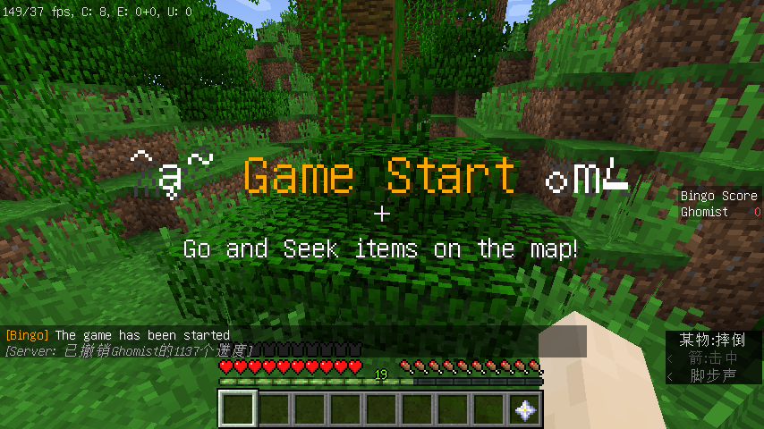
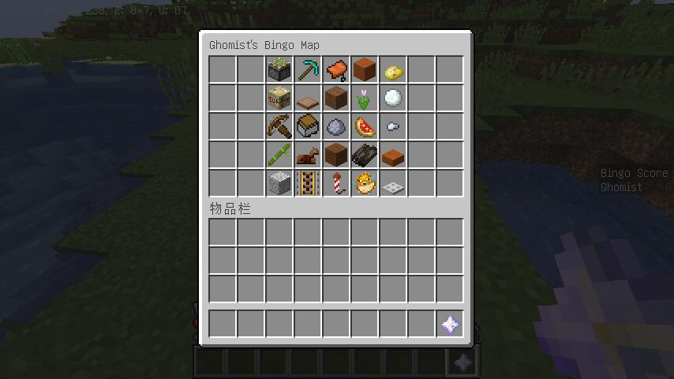

# Minecraft Bingo

**在 Minecraft 1.17.x 玩 Bingo !** 
只是一个简单的 Bingo 插件罢了

## 预览图

## 什么是 Bingo

### 规则简介

加入游戏时，每名玩家将收到一张 Bingo 卡(下界之星)，卡面上标注了 25 个物品/方块，并置于 5 乘 5 的表格中 
游戏开始时，玩家从随机出生的位置开始，寻找 Bingo 卡上的物品/方块 
游戏结局取决于设立一局 Bingo 游戏时所设定的模式，详见下文.

### 相关内容

[维基百科](<https://en.wikipedia.org/wiki/Bingo_(American_version)>) ([中文页面](https://zh.wikipedia.org/wiki/%E7%BE%8E%E5%BC%8F%E8%B3%93%E6%9E%9C))

## 依赖

**1.17.\* Spigot**(或 Paper) 服务器.

## 指令列表

- `/bingo` 
  最基本的指令. 一般不直接使用.
- `/bingo setup [allcollect]|[shareinventory]` 
  设立一个新的 Bingo 游戏. 指令后可以跟两个模式(不分先后，可不填): **allcollect** 和 **shareinventory** . 
  **allcollect**: 当某玩家收集到所有物品时游戏结束. 否则当某玩家收集一整行或列，或集齐某一对角线时结束. 
  **shareinventory**: 所有玩家共用一张 Bingo 卡. 这意味着某玩家收集一个物品时，他将会占据该物品的位置，其他玩家将不能利用该位置取胜. 若同时选择了 allcollect 则某一队达到制胜数量(2 名玩家时为 13 件物品)时游戏结束.
- `/bingo join [red|blue|yellow|green]` 
  加入以某种颜色命名的队伍.
- `/bingo start` 
  开始一局 Bingo 游戏. 这将会清除已加入玩家的背包和药水效果，再于正式开始时给予永久夜视和一张 Bingo 卡.
- `/bingo check <player-name>` 
  用于悄悄检查别人的 Bingo 卡.
- `/bingo playerlist` 
  显示当前已参与的玩家列表.
- `/bingo shutdown` 
  强制关闭一局 Bingo 游戏.
- `/bingo help` 
  帮助列表(用处不大其实).
- `/bingo up` 
  快速传送至地面(其实是当前 x, z 座标的最高点).

## 物件列表

只有 [**这个列表**](src/main/resources/config.yml) 所示的物件才会在 Bingo 卡上出现.
